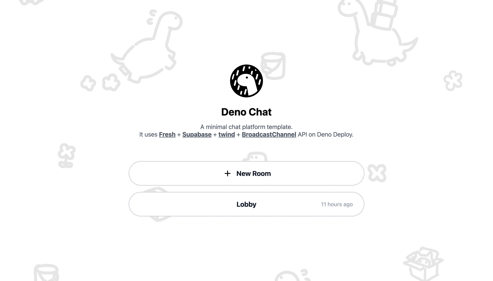

## `showcase_chat`

A minimal chat platform template. It uses [Fresh](https://fresh.deno.dev) +
[Supabase](https://supabase.io) + [twind](https://twind.dev) +
[BroadcastChannel API](https://developer.mozilla.org/en-US/docs/Web/API/Broadcast_Channel_API)
on Deno Deploy.

To get started, setup your `.env` with Supabase and Github OAuth credentials:

To setup a
[Github OAuth App](https://developer.github.com/apps/building-oauth-apps/authorizing-oauth-apps)

- Go to https://github.com/settings/applications/new
- Set `Application name` to `Deploy Chat Example`
- Set `Homepage URL` to your Deno Deploy project URL. (eg:
  `chat-app-example.deno.dev`)
- Set `Authorization callback URL` to `http://chat-app-example.deno.dev` or
  localhost for development.
- Paste `Client ID` and `Client Secret` in `.env`

Create a Supabase project

- Go to app.supabase.io
- Click on "New Project".
- Enter project details and wait for the database to launch.
- Go to the SQL Editor and run the SQL from below
- Grab the URL and anon key from the "Settings" > "API"

```
CLIENT_ID=abc
CLIENT_SECRET=abc123
SUPABASE_ANON_KEY=xyz
SUPABASE_API_URL=https://xyzxyzxyzxyzxyzxyzxy.supabase.co
SUPABASE_DB_HOSTNAME=db.xyzxyzxyzxyzxyzxyzxy.supabase.co
SUPABASE_DB_PASSWORD=xyz123
```

and fire up the server:

```
deno task start
```
